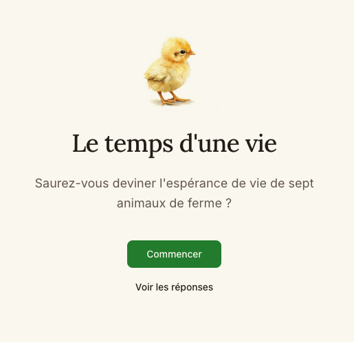

# Le temps d'une vie

An educational quiz about farm animal lifespans. Can you guess how long these animals actually live in farming conditions?



## Features

- Interactive quiz with 7 farm animals
- Custom vegetal slider for guessing ages
- Animated heart visualization showing life percentage
- Bilingual support (French/English)
- Responsive design with desktop sidebar

## Tech Stack

- Next.js 15
- TypeScript
- Tailwind CSS v4
- shadcn/ui
- nuqs (URL state management)
- next-intl (internationalization)

## Getting Started

```bash
npm install
npm run dev
```

Open [http://localhost:3000](http://localhost:3000) to view the app.

## Data Source

Animal lifespan data sourced from [L214](https://www.l214.com/).

## Author

Created by [Dimitri Bourreau](https://dimitribourreau.dev)
